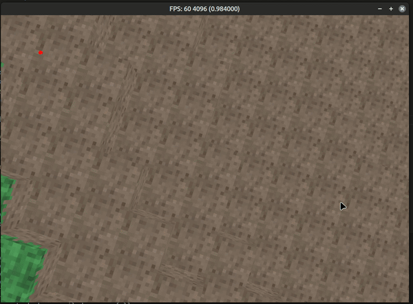

Voxels 
This school project is an introduction to voxel engines, inspired from Minecraft, in which we had to procedurally generate the world around the player.

This project was made using:

    C++
    OpenGL
    SDL2

# Some screenshots

